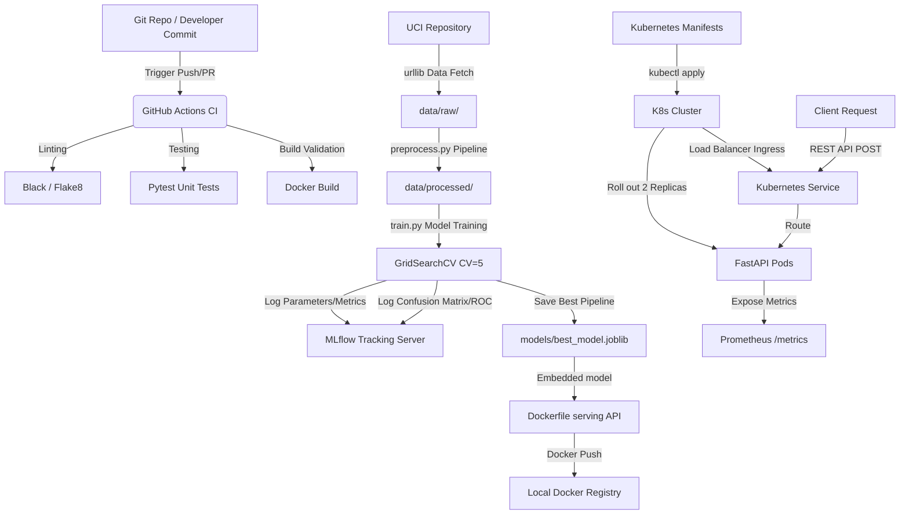
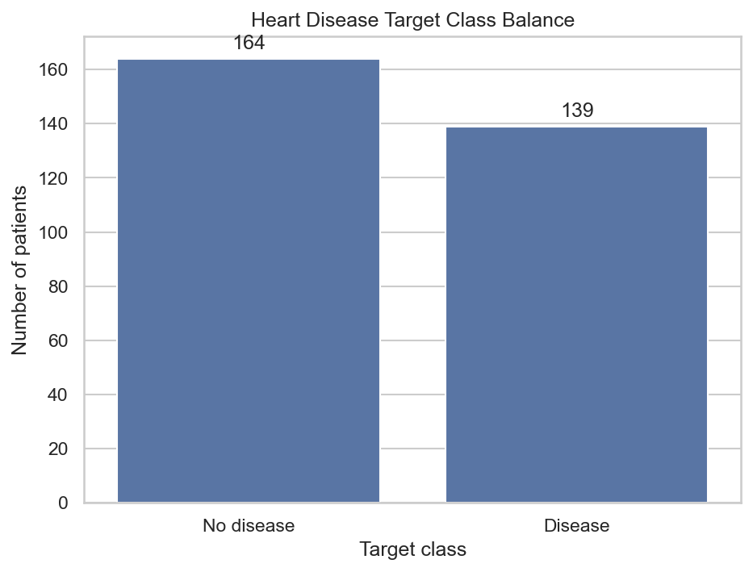
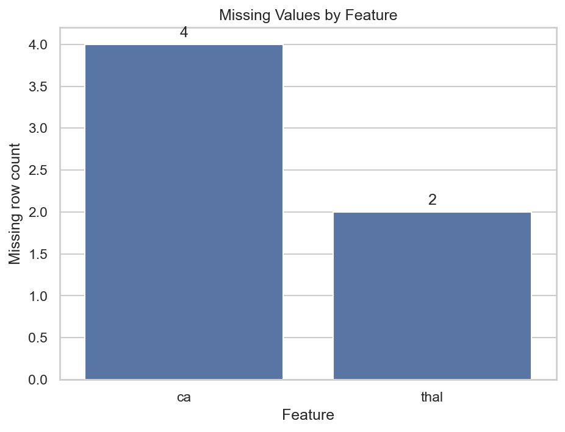
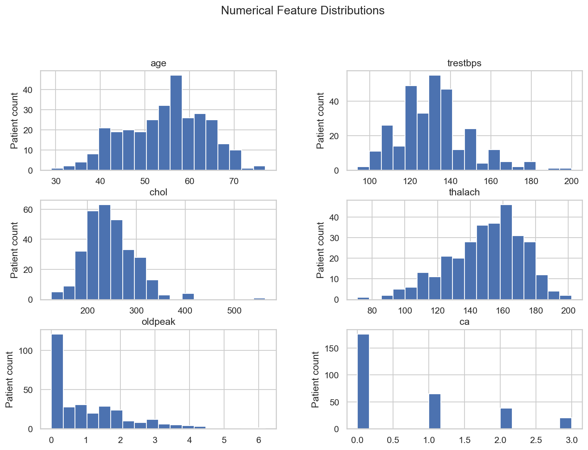
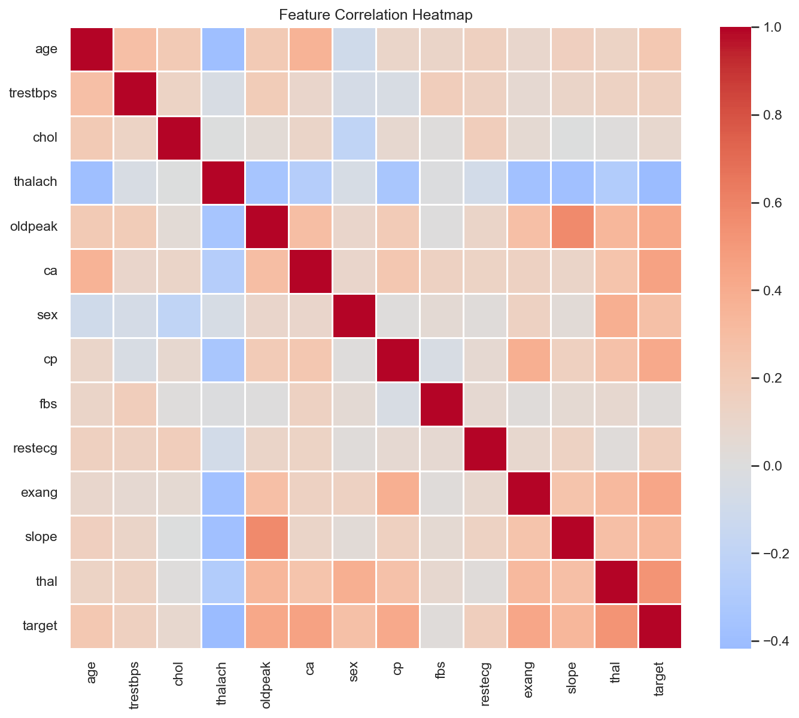
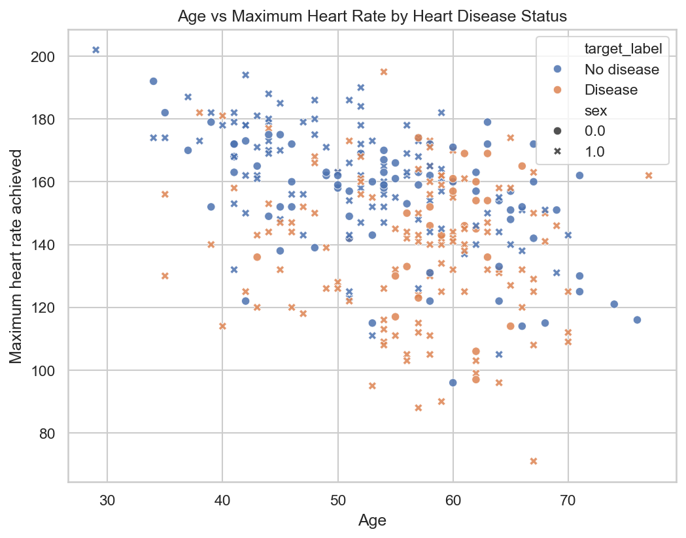

# MLOps Assignment 01: End-to-End Production Machine Learning Pipeline
**Course**: Machine Learning Operations (MLOps) AIMLCZG523  
**Project**: Heart Disease Classification & serving API  
**GitHub username**: `Rajvik85`  
**Recommended repository URL**: `https://github.com/Rajvik85/MLOPS-Assignment-1`

---

## 1. Project Overview

The objective of this assignment is to design, implement, and deploy a reproducible, scalable, and monitored Machine Learning pipeline to predict the presence of heart disease in patients. Using the **UCI Cleveland Heart Disease dataset**, the system ingests raw clinical features, applies automated preprocessing steps, fits and tunes binary classifiers, logs metrics and artifacts to a centralized experiment store (MLflow), containerizes the serving layer (FastAPI), and orchestrates resources within a local Kubernetes cluster. 

The design is built around the principles of modularity, code quality, reproducibility, and production readiness.

---

## 2. System Architecture

The overall system architecture follows modern GitOps and MLOps workflows. Below is a block diagram illustrating the flow of code, data, artifacts, and requests:



---

## 3. Data Ingestion & Exploratory Data Analysis (EDA)

### 3.1 Data Acquisition
The dataset is fetched from the official UCI Machine Learning Repository:
`https://archive.ics.uci.edu/ml/machine-learning-databases/heart-disease/processed.cleveland.data`

A CLI utility (`src/download_data.py`) handles HTTP calls, sets target folder paths, and implements logging to verify the integrity and file size of the downloaded `.data` file (18.03 KB).

### 3.2 Exploratory Data Analysis & Preprocessing Discoveries
* **Missing Value Analysis**: A scan of the 303 observations reveals that the features `ca` (number of major vessels colored by fluoroscopy) and `thal` (thalassemia type) contain missing values encoded as the string character `?`. Specifically, `ca` contains 4 missing rows, and `thal` contains 2 missing rows.
* **Target Mapping**: The original label ranges from `0` (absence of disease) to `1, 2, 3, 4` representing degrees of severity. To build a robust binary classifier, we collapse classes 1–4 into a single binary class `1` (presence of heart disease), keeping class `0` as negative.
* **Class Balance**: The target features are relatively balanced with:
  - **No Heart Disease (0)**: 164 patients (54.1%)
  - **Heart Disease Present (1)**: 139 patients (45.9%)
  Because the target classes are well-balanced, standard **Accuracy** combined with **F1-Score** and **ROC-AUC** are chosen as the primary evaluation metrics.

### 3.3 EDA Plot Evidence
The required EDA plots are generated reproducibly by running:

```bash
python -m src.eda
```

The generated plots are stored in `plots/` and cover the FAQ requirements:











---

## 4. Feature Engineering & Preprocessing Pipeline

To eliminate **Training-Serving Skew**, we design a unified scikit-learn `Pipeline` that bundles the entire preprocessing step with the estimator. This ensures that raw inputs sent to the FastAPI server go through the exact same transformations as the training data, preventing data leakage.

* **Numerical Columns** (`age`, `trestbps`, `chol`, `thalach`, `oldpeak`, `ca`):
  - Handled via `SimpleImputer` using the `median` strategy to robustly handle the missing values in `ca`.
  - Scaled using `StandardScaler` to normalize mean to 0 and variance to 1.
* **Categorical Columns** (`sex`, `cp`, `fbs`, `restecg`, `exang`, `slope`, `thal`):
  - Handled via `SimpleImputer` using the `most_frequent` (mode) strategy to impute missing entries in `thal`.
  - Encoded using `OneHotEncoder` with `handle_unknown='ignore'` and `sparse_output=False` to prevent shape mismatches during inference.

---

## 5. Model Development & Hyperparameter Tuning

We implement and compare two classifiers:
1. **Logistic Regression (Baseline)**: A linear classifier providing excellent interpretability and low risk of overfitting.
2. **Random Forest (Complex)**: An ensemble tree classifier capable of modeling non-linear feature interactions.

Both estimators are tuned using a grid search cross-validation strategy (`GridSearchCV`) over 5 folds using `ROC-AUC` as the target score.

### Hyperparameter Search Grids:
```python
# Logistic Regression
param_grid_lr = {
    'classifier__C': [0.01, 0.1, 1.0, 10.0],
    'classifier__solver': ['liblinear', 'lbfgs']
}

# Random Forest
param_grid_rf = {
    'classifier__n_estimators': [50, 100, 200],
    'classifier__max_depth': [None, 5, 10, 15],
    'classifier__min_samples_split': [2, 5, 10]
}
```

---

## 6. Experiment Tracking (MLflow logs)

Both model training configurations are fully tracked using an MLflow tracking session under the experiment `"Heart_Disease_Classification"`.

### Logged Metadata:
* **Parameters**: Evaluated hyperparameter grids (`C`, `solver`, `n_estimators`, `max_depth`, `min_samples_split`).
* **Metrics**: Test set accuracy, precision, recall, F1-score, and ROC-AUC.
* **Plots**: Automatically saved Confusion Matrix and ROC Curve charts generated using `matplotlib`.
* **Model Artifacts**: The complete, fitted scikit-learn pipeline (preprocessor + classifier) is logged to the MLflow repository.

### Performance Summary Table:

| Model Name | Best Hyperparameters | Test Accuracy | Precision | Recall | F1-Score | ROC-AUC |
|---|---|---|---|---|---|---|
| **Logistic Regression** | `C=1.0`, `solver='lbfgs'` | **0.8689** | 0.8125 | **0.9286** | **0.8667** | **0.9578** |
| **Random Forest** | `max_depth=5`, `min_samples_split=10`, `n_estimators=100` | **0.8689** | **0.8333** | 0.8929 | 0.8621 | 0.9426 |

* **Analysis**: While both models achieved an identical test accuracy of **86.89%**, **Logistic Regression** outperformed Random Forest on F1-Score (**86.67%**) and ROC-AUC (**95.78%**), making it the chosen production model.

---

## 7. Model serving API (FastAPI)

The model serving layer is written in Python using the **FastAPI** web framework.
* **Lifespan Manager**: The API loads the serialized `best_model.joblib` pipeline into memory at startup, preventing initialization latency on incoming calls.
* **Input Validation**: Request bodies are validated against a strict JSON schema using a Pydantic `BaseModel` (`PatientData`). 
* **Endpoints**:
  - `GET /health`: Health probe endpoint. Returns a `200 OK` code along with `{"status": "healthy", "model_loaded": true}` if the pipeline has successfully loaded.
  - `GET /metrics`: Serves standard Prometheus metrics (HTTP request counts, durations, and system details) using `prometheus-fastapi-instrumentator`.
  - `POST /predict`: Receives patient data, runs inferences, and returns prediction (`1` or `0`) and confidence (probability).

---

## 8. Unit Testing & CI/CD Pipeline

To ensure pipeline stability and enforce coding best practices, we write unit tests and integrate a CI/CD workflow.

### 8.1 Automated Tests (`pytest`)
* `tests/test_preprocess.py`: Verifies that raw data ingestion correctly handles `?` values, converts fields to numeric, maps target outcomes to binary, and fits/transforms the pipeline.
* `tests/test_api.py`: Tests the FastAPI endpoints. Uses `unittest.mock.patch` to intercept the `joblib.load` method and returns mock outputs to test health probes, schema validation, and prediction responses in isolation.

### 8.2 GitHub Actions CI Pipeline (`mlops_ci.yaml`)
Triggered on push/PR to `main` branch, performing:
1. Environment setup and installation of dependencies.
2. Lint checking with `black --check` and `flake8 --ignore=E501`.
3. Auto-download of the dataset via `download_data.py`.
4. Execution of tests via `pytest` with coverage output.
5. Verifying that the training pipeline successfully creates model artifacts.
6. Build validation of the Docker container.

The GitHub Actions success screenshot should be saved in `screenshots/` after the repository is pushed to GitHub.

---

## 9. Containerization & Production Deployment

### 9.1 Docker Container (`Dockerfile`)
We compile the container using a **multi-stage build** targeting `python:3.10-slim`.
* **Stage 1 (builder)**: Installs build dependencies and installs the packages listed in `requirements.txt` to the user local path.
* **Stage 2 (runner)**: Copies installed python wheels, the source directories, and the pre-trained `models/` artifacts into a clean minimal environment.
* **Security & Reliability**: The container runs under a non-privileged user (`appuser`, UID 1000) for security, defines environment variables to force unbuffered output logs (`PYTHONUNBUFFERED=1`), and includes a native python-based health check probe.

### 9.2 Kubernetes Orchestration (`deployment.yaml` & `service.yaml`)
* **Deployment**:
  - Configured with `replicas: 2` to guarantee high availability.
  - Applies a `RollingUpdate` rollout strategy (`maxSurge: 1`, `maxUnavailable: 0`) to prevent downtime during updates.
  - Defines resource limits (`cpu: 500m`, `memory: 512Mi`) to prevent resource starvation.
  - Instruments `livenessProbe` and `readinessProbe` checking the `/health` endpoint to automatically recycle unhealthy container instances.
* **Service**: Exposes the serving API as a `LoadBalancer` to route external traffic to the pod replicas.

---

## 10. Monitoring & Logging Strategy

* **Application Logs**: Standard python `logging` is implemented. Every incoming request payload, prediction output, validation error, and pipeline loading status is printed to `stdout`/`stderr` in JSON format, allowing easy scraping by log aggregators (e.g. Loki, FluentBit).
* **Prometheus Metrics**: The FastAPI server exposes request counters and histograms under `/metrics`. These can be scraped by a Prometheus server and visualized on Grafana dashboards to monitor latency, throughput, error rates, and resource utilization.

---

## 11. Final Submission Evidence To Attach

The code and configuration files implement the assignment requirements. The following runtime evidence should be added before final submission:

* GitHub repository URL.
* MLflow screenshots showing both model runs, metrics, and artifacts.
* GitHub Actions screenshot showing the CI pipeline passed.
* Docker build/run screenshots and `/predict` response.
* Kubernetes pod/service screenshots and deployed endpoint test.
* `/metrics` monitoring screenshot.
* Short video recording of the pipeline workflow.
