# Screenshot Appendix

Use these selected screenshots as report evidence.

## MLflow Experiment Tracking

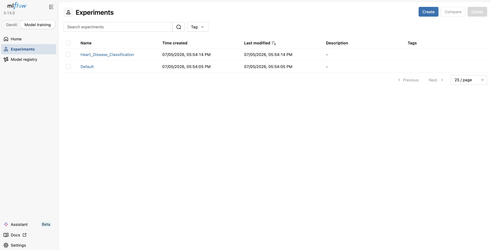

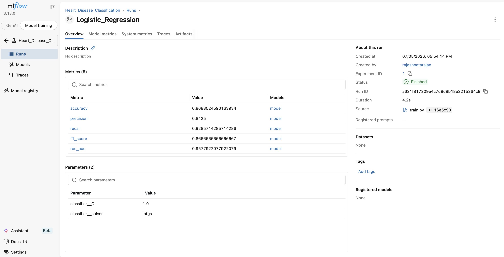

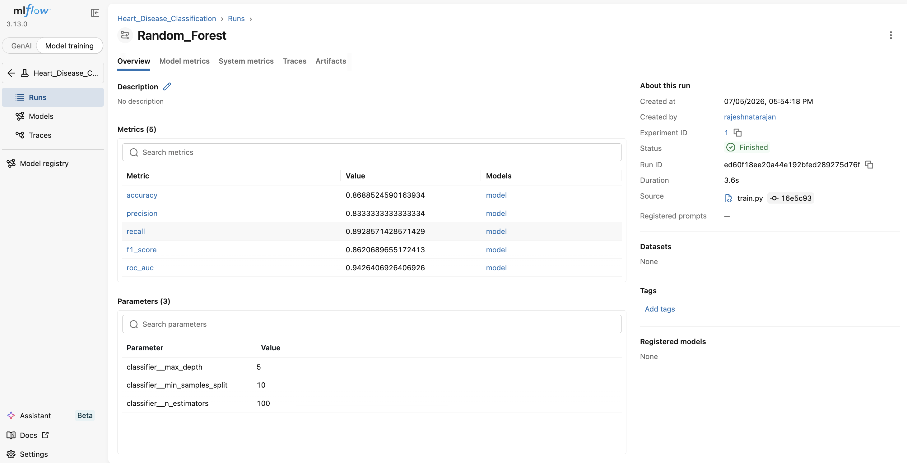

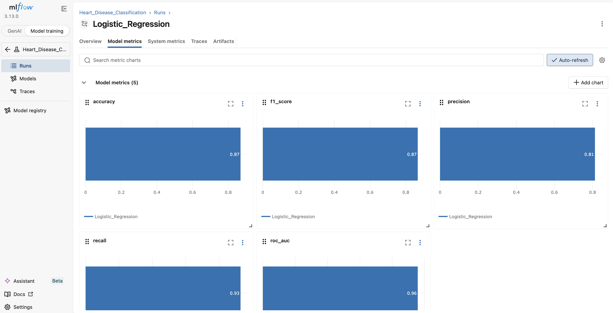

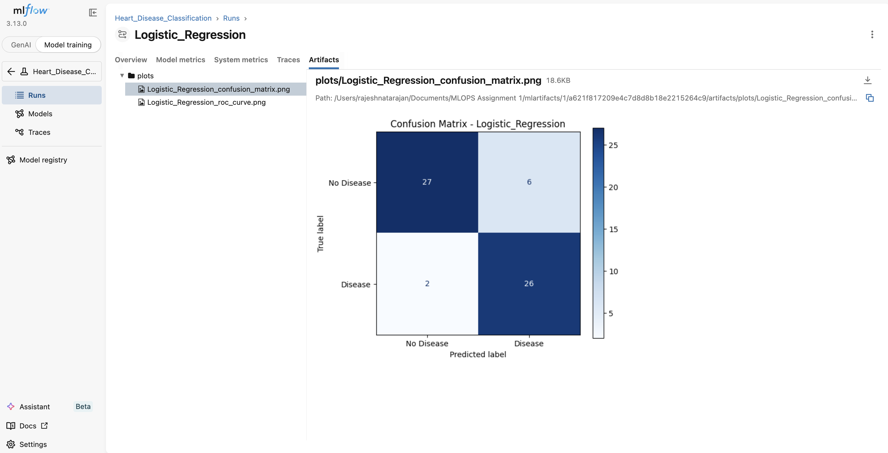

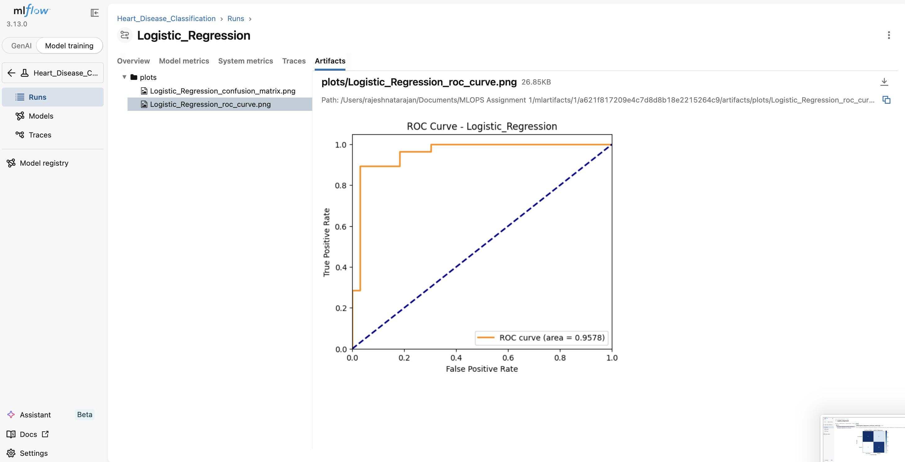

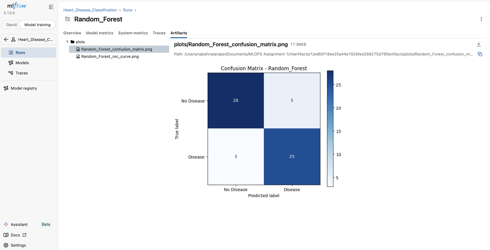

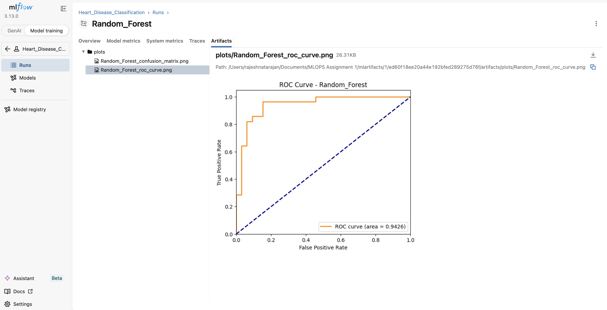

## API And Monitoring

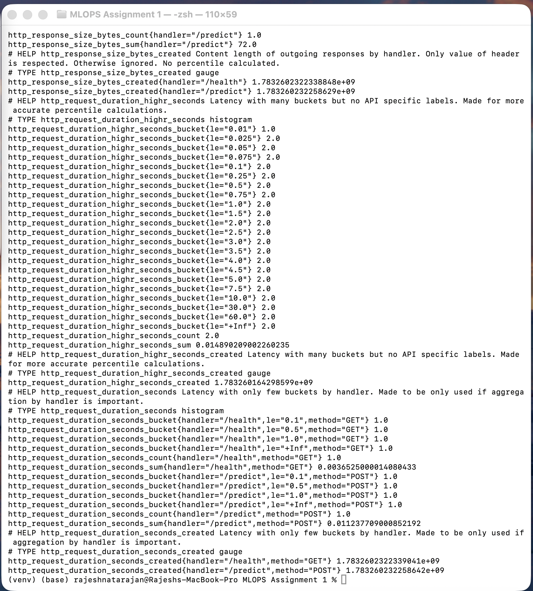

## Docker Or Local API Proof

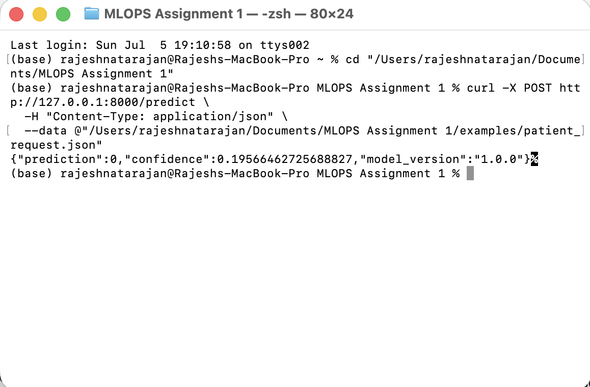

## Kubernetes Deployment

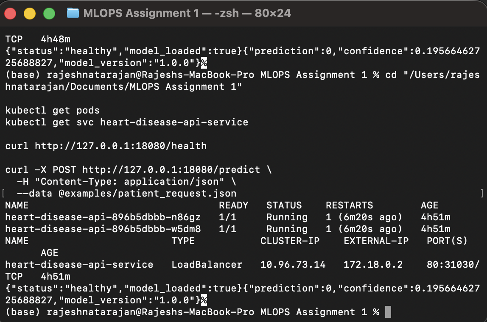

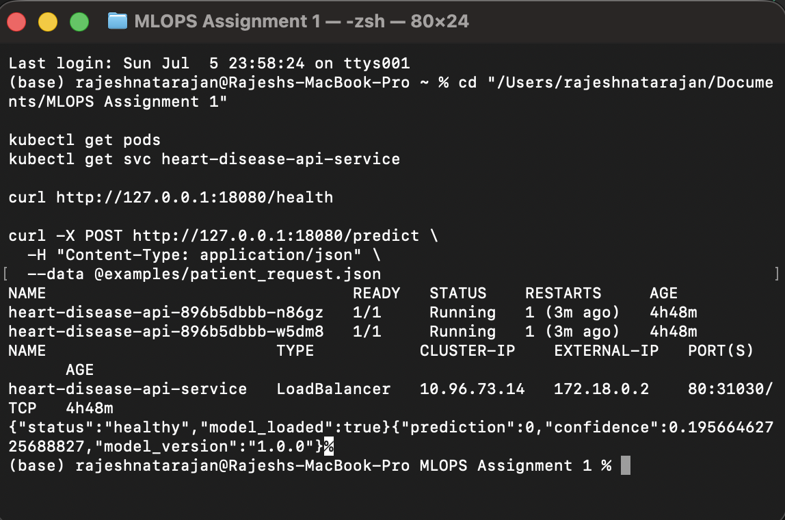

